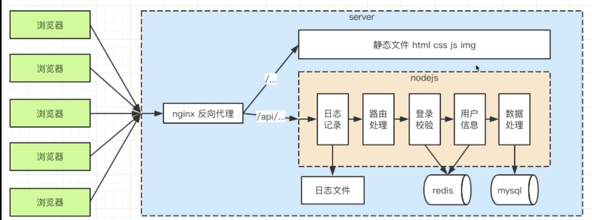

# blog-1 不使用框架开发 server 的总结

* 开放了哪些功能模块、完整的流程
* 用到了哪些核心的知识点
* 回顾 "server 和 前端的区别"



## 功能模块

1. 处理 http 接口
2. 连接数据库
3. 实现登录
4. 日志
5. 安全
6. 上线（--）

## 核心知识点

* http, nodejs 处理 http, 处理路由, mysql
* cookie, session, redis, nginx 反向代理
* sql 注入, xss 攻击, 加密
* 日志, stream, crontab, readline
* (线上)

## server 和前端的区别

* 服务稳定性（--）
* 内存 CPU（优化 扩展）[stream, session-redis]
* 日志记录
* 安全（含 登录验证）
* 集群和服务拆分（设计已支持）

## Web 安全

* sql 注入：窃取数据库内容
* xss 攻击：窃取前端的 cookie 内容
* 密码加密： 保障用户信息安全

```text
sql 注入：
1. 最原始、最简单的攻击，从有了web2.0就有了 sql 注入攻击
2. 攻击方式： 输入一个 sql 片段，最终拼接成一段攻击代码
3. 预防措施： 使用mysql.escape 函数处理输入内容即可（特殊字符转义）

xss 攻击：
1. 前端同学最熟悉的攻击方式，但 server 端更应该掌握
2. 攻击方式：在页面展示内容中掺杂 js 代码，以获取网页信息
3. 预防措施：转换生成 js 的特殊字符
(
&. -> &amp;
<  -> &lt;
>  -> &gt;
"  -> &quot;
'  -> &#x27;
/. -> &#x2F;
)
<script>alert(document.cookie)</script>

密码加密：
1. 万一数据库被用户攻破，最不应该泄漏的就是用户信息
2. 攻击方式：获取用户名和密码，再去尝试登录其它系统
3. 预防措施：将密码加密，即便拿到密码也不知道明文
```

## http-server

nginx 反向代理：

```bash
sudo vim /usr/local/etc/nginx/nginx.conf
# > [update location]
server {
        listen       8080;
        server_name  localhost;

        #location / {
        #    root   html;
        #    index  index.html index.htm;
        #}

        location / {
                proxy_pass http://localhost:8001;
        }
        location /api/ {
                proxy_pass http://localhost:8000;
                proxy_set_header Host $host;
```

html 服务
http-server -p 8001
