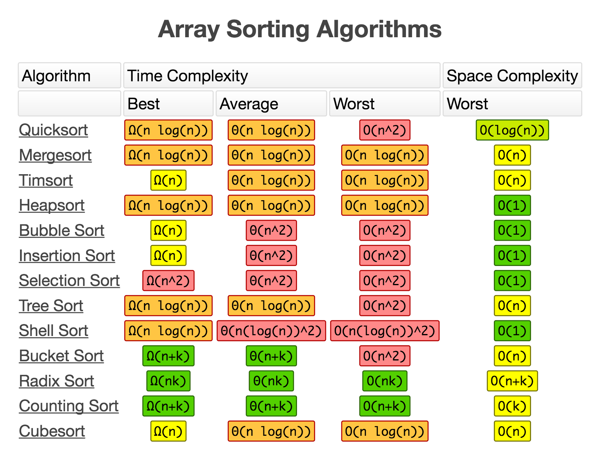
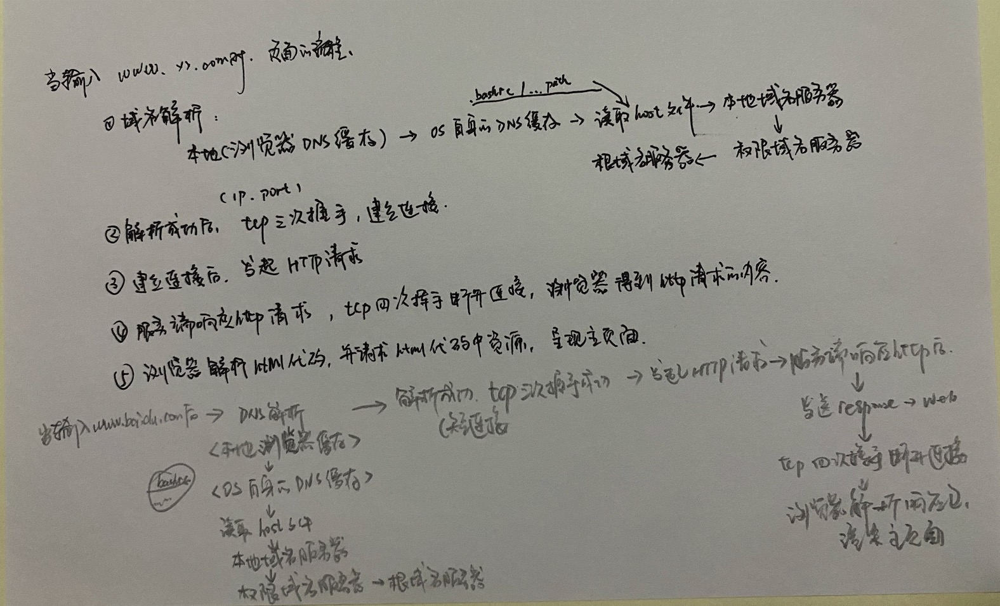

# Test-Interview-knowledge-Map


## 面试相关

* [自我介绍](#1)
* [项目经验](#2)
* [数据结构与算法](#3)
* [Linux](#4)
* [数据库/redis](#5)
* [软件测试基础](#6)
* [计算机基础知识](#7)
* [剑指offer题解](./剑指offer_IN_ONE.md)

### <span id = "1">1. 自我介绍</span>

略

### <span id = "2">2. 项目经验</span>

采用star法则进行项目的描述，回答一系列的follow up。体现出自己的能力(工作能力、专业能力、沟通能力、适应能力等)

### <span id = "3">3. 数据结构与算法</span>

#### 3.1 python 常考基础

[以下 python 常见问题及解答](./python/_py_basic.md)

* 生成器与迭代器
* python 运算符
* 同步异步阻塞和非阻塞的理解
* select、poll、epoll 模型的区别
* python 单例模式实现
* With机制及如何实现
* python参数传递: 传值与传引用
* 深拷贝与浅拷贝
* [python 垃圾回收](./python_gc.md)

#### 3.2 数据结构与算法

数据结构/算法 复杂度


* [python 内置数据结构](./数据结构与算法/py3_数据结构.py)

---
以下为简单实现

* [数组](./数据结构与算法/05_array.py)
* [链表](./数据结构与算法/06_1_singly_linked_list.py)、[链表常见算法](./数据结构与算法/06_3_linked_list_algo.py)、[LRU](./数据结构与算法/06_2_LRUCache.py)

    
* [栈](./数据结构与算法/08_stack.py) 和 [队列](./数据结构与算法/09_queue.py)
* [排序](./数据结构与算法/11_sort.py)
    * 排序的复杂度
    
* [树、树遍历、二叉查找树bst、bfs/dfs概念](./数据结构与算法/23_tree.md)
    * 前中后序遍历
    
* [图[bfs/dfs]](./数据结构与算法/23_bfs_dfs.py)
    * 广度优先搜索算法(BFS)
        * 横向优先搜索，优先搜索同以层次的节点

            
        * 广度优先搜索的空间消耗主要在几个辅助变量 visited 数组、queue 队列、prev 数组上
    * 深度优先搜索算法(DFS)
        * 是一种用于遍历或搜索树或图的算法。沿着树的深度遍历树的节点，尽可能深的搜索树的分支。
            当节点v的所在边都己被探寻过，搜索将回溯到发现节点v的那条边的起始节点

            
        * 深度优先搜索算法的消耗内存主要是 visited、prev 数组和递归调用栈
* [hash](./数据结构与算法/18_hashtable.md)
---
* 滑动窗口
* 递归
* 动态规划
* 二分
* 位运算
* 字符串匹配

### <span id = "4">4. Linux</span>

[常用 bash 命令](./bash命令/README.md)

### <span id = "5">5. 数据库/redis</span>

#### 数据库常考

[MySQL 语句题](./mysql-notes/README.md)

索引（调优）、事务（锁、多线程）、基础（表连接、主外键、语句编写）、深入（引擎）

基础:  
* sql 的join的几个方式；左连接和右连接的区别
* 讲讲各种数据库连接的区别，内连接，外连接，笛卡尔连接
* MySQL语句执行顺序
* 子查询、聚合函数、视图、存储过程、触发器等
* explain查询计划
---
* 了解哪些存储引擎
* 主外键、数据库完整性约束
* 不同数据库的比较，即对不同场景怎样选用数据库

事务:

* ACID (含义与理解 + 如何保证)
* 隔离等级与相应问题
* 多版本并发控制 (MVCC)
* 长事务的危害与避免方法
M* ySQL有哪些锁，区别 (全局锁、表锁、元数据锁、行锁、间隙锁、next-key-lock、【页锁】)
* 如何解决死锁 (死锁检测、控制并发度(客户端、中间件、服务端、数据库))

索引

* 创建索引注意事项（是否常用、区分度、数量、组合索引选择、主键选择、唯一与普通的选择）
* 索引的类别（从存储方式来分：聚簇索引与非聚簇索引；从属性个数来分：单值和组合索引；
从是否唯一来分：唯一、普通和主键；从数据结构来分：B+树、hash表、数组等）
* 索引的数据结构及具体实现介绍（核心是MySQL为什么选B+树；以及B+树、hash表、数组的区别；）
* 索引什么时候失效 （在where索引字段有函数操作、数据量太小、analysis不准、排序、不满足最左匹配、其他索引干扰、使用了 in、非判断（！=、is null、is not null）等）
* 索引的特性（回表、最左前缀匹配原则、索引下推优化）
* changeBuffer（普通索引与唯一索引的选择与优化）

#### <span id = "redis">redis 常考</span>


* [redis 连环问](https://dunwu.github.io/javatech/cache/cache-interview.html#%E4%B8%BA%E4%BB%80%E4%B9%88%E8%A6%81%E7%94%A8%E7%BC%93%E5%AD%98)
* Redis的雪崩、击穿
    * redis 缓存雪崩
        * 原因: 当某一时刻发生大规模的缓存失效的情况，会有大量的请求进来直接打到DB上面
        * 处理缓存雪崩: 
            1. redis的key在同一时间大面积失效
                * 在批量往Redis存数据的时候，把每个Key的失效时间都加个随机值，这样可以保证数据不会在同一时间大面积失效
                ```
                setRedis（Key，value，time + Math.random() * 10000）；
                ```
                * 设置热点数据不设置过期时间，有更新操作就更新缓存
            2. redis挂了
                * 使用集群缓存，保证缓存服务的高可用
                * 开启Redis持久化机制，尽快恢复缓存集群
            3. 防止MySQL不挂
    * 缓存穿透
        * 原因: 用户不断发起请求缓存和数据库中都没有的数据
        * 处理缓存穿透:
            1. 接口层增加校验 (用户鉴权、参数校验等)
            2. 缓存空值 (为这些key对应的值设置为null 丢到缓存里)
            3. 布隆过滤器(Bloom Filter) (用于判断某个元素（key）是否存在于某个集合中)
                * 先把数据库的数据都加载到过滤器中，在缓存之前在加一层BloomFilter，
                    在查询的时候先去 BloomFilter 去查询 key 是否存在，如果不存在就直接返回，存在再走查缓存，然后查DB
            4. Nginx (限制单个IP每秒访问次数在阈值内)
    * 缓存击穿
        * 原因: 缓存击穿是指一个Key非常热点，在不停的扛着大并发，大并发集中对这一个点进行访问，当这个Key在失效的瞬间，持续的大并发就穿破缓存，直接请求数据库。
        * 处理缓存击穿
            1. 设置热点数据永远不过期
            2. 互斥锁
                * 在第一个查询数据的请求上使用一个互斥锁来锁住它。其他的线程走到这一步拿不到锁就等着，
                    等第一个线程查询到了数据，然后做缓存。后面的线程进来发现已经有缓存了，就直接走缓存。

* redis和电商结合你知道吗？redis高并发场景下比如抢购你怎么使用redis？怎么测试？
    * [淘宝秒杀场景](http://www.51testing.com/html/62/n-3720162.html)
    * [测试方案(性能测试)](https://www.jianshu.com/p/ee1390d2770c)

### <span id = "6">6. 软件测试基础</span>


常考知识

* [功能测试](./functional-test/functional-test-cn.md)
* 黑盒测试和白盒测试
* 常用测试用例设计方法
* 测试的流程
* 对测试开发的认识
* 了解哪些测试前沿技术
* 是否有界面测试、自动化测试、接口测试、性能测试、diff测试等测试类型经验
* 接口测试

    

用例设计

* 测试 秒杀场景
* 测试一个登录界面
* 测试微信聊天界面
* 测试某个网站的首页
* 一部电梯设计测试用例
* 测试 微信红包
* 测试抖音客户端修改用户名
* 测试视频通话
* 测试一个口罩
* 测试抖音的播放功能

场景题

* 打不开一个网页，你想到有哪些原因吗？
* 用户界面显示修改成功，但是刷新后发现没有修改成功怎么办？你会怎么分析这个问题？你会使用什么工具去排查这个问题？
* 淘宝的支付失败，排查
* 页面加载内容异常，排查
* 淘宝收藏功能测试，比如收藏的星星点亮了，但是数据没有加一。如何排查

### <span id = "7">7. 基础知识</span>

计算机网络

* TCP/UDP的区别
* 三次握手、四次挥手（tcp连接，为什么不是两次和四次；tcp断开连接为什么不是三次挥手）
* tcp如何保证稳定传输的
* OSI模型、TCP/IP模型
* 各层的常用协议
* 常用端口号（http、https、Tomcat等）

HTTP

* http报文格式
    * 请求报文格式
    
        
    * 响应报文格式

        
    * 

* HTTP状态码
    ||||
    |-|-|-|
    ||类别|原因短语|
    |1xx|Informational（信息性状态码）|接受的请求正在处理|
    |2xx|Success（成功状态码）|请求正常处理完毕|
    ||200 OK|表示从客户端发送给服务器的请求被正常处理并返回|
    ||204 No Content|表示客户端发送给客户端的请求得到了成功处理，但在返回的响应报文中不含实体的主体部分（没有资源可以返回）|
    ||206 Patial Content|表示客户端进行了范围请求，并且服务器成功执行了这部分的GET请求，响应报文中包含由Content-Range指定范围的实体内容|
    |3xx|Redirection（重定向）|需要进行附加操作以完成请求|
    ||301 Moved Permanently|永久性重定向，表示请求的资源被分配了新的URL，之后应使用更改的URL|
    ||302 Found|临时性重定向，表示请求的资源被分配了新的URL，希望本次访问使用新的URL|
    |||301与302的区别：前者是永久移动，后者是临时移动（之后可能还会更改URL）|
    ||303 See Other|表示请求的资源被分配了新的URL，应使用GET方法定向获取请求的资源|
    |||302与303的区别：后者明确表示客户端应当采用GET方式获取资源|
    |4xx|Client error（客户端错误）|客户端请求出错，服务器无法处理请求|
    ||400 Bad Request|表示请求报文中存在语法错误|
    ||401 Unauthorized|未经许可，需要通过HTTP认证|
    ||403 Forbidden|服务器拒绝该次访问（访问权限出现问题）|
    ||404 Not Found|表示服务器上无法找到请求的资源，除此之外，也可以在服务器拒绝请求但不想给拒绝原因时使用|
    |5xx|Server Error（服务器错误）|服务器处理请求出错|
    ||500 Inter Server Error|表示服务器在执行请求时发生了错误，也有可能是web应用存在的bug或某些临时的错误时|
    ||502 Bad Gateway|代理服务器(Nginx)或网关从上游服务器中收到无效响应|
    ||503 Server Unavailable|表示服务器暂时处于超负载或正在进行停机维护，无法处理请求|
    ||504 Gateway Time-out|代理服务器(Nginx)或网关 超时|

* http、https区别；分别属于（作用于）哪几层
    ```
    http: Internet上使用最广泛的网络协议。它是客户端和服务器请求和响应标准（TCP），用于将超文本从WWW服务器传输到本地浏览器。
    Http 使用纯文本进行数据传输，这很容易被非法分子窃取和篡改
    
    https: HTTPS在HTTP上构建SSL加密层，并对传输的数据进行加密。
        1. 加密数据并建立信息安全通道，以确保传输过程中的数据安全
        2. 验证网站服务器的真实身份
    区别:
        1. https 是加密的传输协议，http 是文本传输协议；
        2. https需要 SSL 证书，但 http 不需要；
        3. https 比 http 更安全，对搜索引擎更友好，并且对SEO有益。
        4 .https 标准端口443，http 标准端口80；
        5. https 基于传输层，http 基于应用程序层；
        6. https 在浏览器中显示绿色的安全锁，但 http 不显示；
    通常，https 比 http 更安全，并且可以有效地保护网站用户的隐私
    ```
* 对称加密和非对称加密区别以及具体https中如何使用的
    ```
    对称加密就是加密和解密用的是同一个密钥k。 对称加密快
    非对称加密是发送端使用公开的公钥a加密，然后接收端使用私密的私钥b解密。 非对称加密安全

    https 如何使用对称/非对称加密的:
    使用非对称加密传输一个对称密钥K，让服务器和客户端都得知。然后两边都使用这个对称密钥K来加密解密收发数据。
    因为传输密钥K是用非对称加密方式，很难破解比较安全。而具体传输数据则是用对称加密方式，加快传输速度。
    ```
* get与post的区别
    ||GET|POST|
    |-|-|-|
    |请求参数|GET请求参数是通过URL传递的，多个参数以&连接|POST请求放在request body中|
    |请求缓存|GET请求会被缓存|而POST请求不会，除非手动设置|
    |收藏为书签|GET请求支持|POST请求不支持|
    |安全性|POST比GET安全,GET请求在浏览器回退时是无害的|POST会再次请求|
    |历史记录|GET请求参数会被完整保留在浏览历史记录里|POST中的参数不会被保留|
    |编码方式|GET请求只能进行url编码|POST支持多种编码方式|
    |对参数的数据类型|GET只接受ASCII字符|POST没有限制|
    ```
    通过浏览器地址栏输入URL访问资源的方式都是GET请求
    ```
* cookie和seesion的区别和工作原理的差别
    ```
    区别:
    1. cookie数据存放在客户的浏览器（客户端）上，session数据放在服务器上，但是服务端的session的实现对客户端的cookie有依赖关系的；
    2. cookie不是很安全，别人可以分析存放在本地的COOKIE并进行COOKIE欺骗，考虑到安全应当使用session；
    3. session会在一定时间内保存在服务器上。当访问增多，会比较占用你服务器的性能。考虑到减轻服务器性能方面，应当使用COOKIE；
    4. 单个cookie在客户端的限制是3K，就是说一个站点在客户端存放的COOKIE不能超过3K；

    工作原理:
    HTTP 是无状态协议，说明它不能以状态来区分和管理请求和响应。也就是说，服务器单从网络连接上无从知道客户身份。

    cookie 相当于通行证。客户端访问都必须携带通行证。这样服务器就能从通行证上确认客户身份了。这就是Cookie的工作原理。
    Cookie是服务器在本地机器上存储的一小段文本，并随着每次请求发送到服务器
    Cookie技术通过请求和响应报文中写入Cookie信息来控制客户端的状态。
        1. Cookie会根据响应报文里的一个叫做Set-Cookie的首部字段信息，通知客户端保存Cookie。
            当下客户端再向服务端发起请求时，客户端会自动在请求报文中加入Cookie值之后发送出去
        3. 之后服务端发现客户端发送过来的Cookie后，会检查是那个客户端发送过来的请求，然后对服务器上的记录，最后得到了之前的状态信息

    Session
        1. 客户端把信息放入报文的实体部分，通常是以POST 方法把请求发送给服务器。
        2. 服务器会发放用以识别用户的Session ID。通过验证从客户端发送过来的信息进行验证，然后把用户的认证状态与Session ID 绑定后记录在服务器端。
            向客户端返回响应时，会在首部字段Set-Cookie 内写入Session ID（如PHPSESSID=l128ogl…）
        4. 客户端接收到从服务器端发来的Session ID 后，会将其作为Cookie 保存在本地。下次向服务器发送请求时，浏览器会自动发送Cookie，
            所以Session ID 也随之发送到服务器。服务器端可通过验证接收到的Session ID 验证状态。(如果禁用Cookie后，可将sessionid拼接到url)
    ```
* 输入网址到页面呈现的全部过程

    
* 静态资源是如何请求到的
* 重定向，能仔细讲讲重定向吗？能说说为什么使用重定向吗？知道怎么实现的吗？

操作系统

* 进程、线程的区别
    ```
    在Linux中，进程和线程几乎没有区别。进程通fork()新建子进程，通过pthread()新建线程，子进程和线程唯一的区别在于，共享的数据区域不同
    - 子进程: 子进程完全拷贝了一份父进程的内存副本
    - 线程:   线程某些数据区域(*mm *files)与父进程共享  (stat、pid、children 独有)
    所以多线程要利用锁机制，避免多个线程同时往同一区域写数据，否则可能造成数据错乱

    Tips: 因为 Linux 采用 copy-on-write 的策略优化，解决新建进程时内存区域拷贝的问题。所以 Linux 中新建进程和线程都很迅速

    why 多线程的使用比多进程普遍的多？
    - 现实中数据共享的并发更普遍。比如多人同时从一个账户取钱的例子
    ```

    
* 

中间件

* 了解消息队列么
* [redis](#redis)
