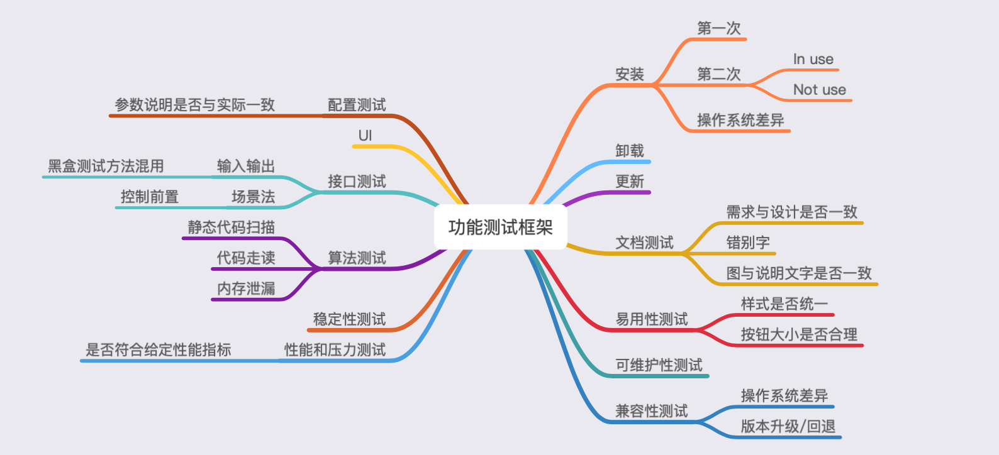

# FrameWork

## 接口测试

[接口测试](https://zh.wikipedia.org/wiki/%E6%8E%A5%E5%8F%A3%E6%B5%8B%E8%AF%95)是软件测试的一种，它包括两种测试类型：狭义上指的是直接针对应用程序接口（下面使用缩写API指代，其中文简称为接口）的功能进行的测试；广义上指集成测试中，通过调用API测试整体的功能完成度、可靠性、安全性与性能等指标。

* 黑盒测试
  * 等价类
  * 边界值
  * 判定表
  * 流程分析
  * 状态机
  * 错误猜测
* 白盒测试
  * 语句覆盖
  * 分支覆盖
  * 条件覆盖
  * 分支-条件覆盖
  * 路径覆盖
  * 错误猜测

## 性能测试

性能测试，针对给出的性能指标，建立性能测试模型、制定性能测试方案及监控策略，在场景条件之下执行性能场景，分析判断性能瓶颈并调优，最终得到性能结果以此来评估性能指标是否满足系统预设值。

### 性能指标

* 每秒事务数 TPS
* 响应时间 RT
* 吞吐量 Throughut

### 性能工具

* JMeter
