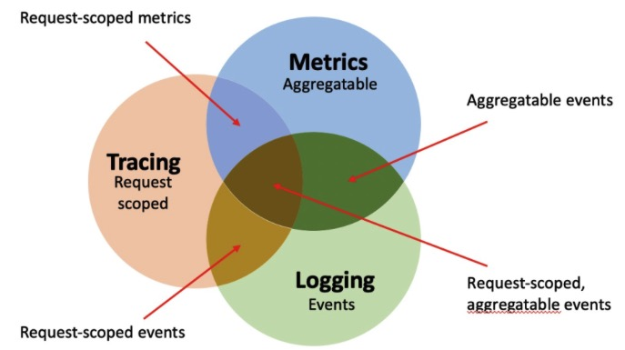
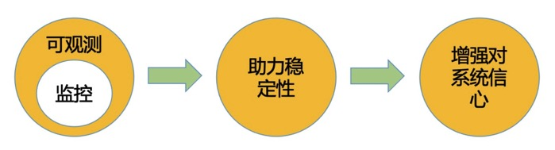
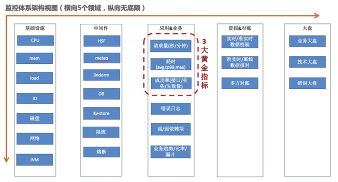

# 系统可观测性

## 1 什么是系统可观测性

可观测性(observerbality)，是一个最近几年开始在监控社区流行起来的术语，可观测性的提出最早来自于 Google 著名的 SRE 体系和 Apple 工程师 Cindy Sridharan 的博文《Monitoring and Oberservability》，感兴趣的同学可以看一下。

可观测性不是一种具体的工具或技术，更偏向于是一种理念，目前已成为复杂分布式系统成功管理的关键组成部分，它是指运行中的系统可被调试的能力，这种可调试能力的核心就是能够在系统运行时对其理解、询问、探查和调度。

理解，询问，探查体现在帮助工程师发现问题 -> 定位问题 -> 解决问题(止损)，调度体现在可根据系统运行状态做出的自动化，智能化决策的能力。

可观测性的目标是增强工程师对系统运行状况的了解，增强对系统的信心。

目前，业界广泛推行的可观测性包含三大支柱：日志事件(Logging)，分布式链路追踪(Tracing) 和 指标监控(Metrics）。

* Logging：不能单纯的理解就是日志，泛指的是应用运行而产生的可以详细解释系统运行状态的各种事件，日志记录是其中最常用一种手段。

* Tracing：全链路追踪，面向的是请求，通过对请求打标、透传、串联，最终可以还原出一次完整的请求，可帮助工程师分析出请求中的各种异常点。

* Metrics：是对Logging事件的聚合，泛指各种指标监控和大盘，通过多维度聚合、分析和可视化展示，帮助工程师快速理解系统的运行状态。

## 2 可观测性与监控的关系

可观测性 != 监控

第一印象很容易把“可观测性”认为就是“监控”，人类一般倾向于用之前的认知来理解一些新概念，其实两者是不一样的。

监控是机器代替人工，长期的观察系统的行为和输出，帮助团队观察和了解其系统状态的工具或技术解决方案。监控与可观测性的区别如下：

### 关注点不同

监控更多关注的是具体指标的变化和报警，关注系统的失败因素，多与运维相关，强调从外到内，从外部通过各种技术手段去看到内部，关注的是点。而可观测性关注的是应用本身的状态，是对系统的一种自我审视，强调从内到外，站在宏观的角度去聚合分析各种指标，不仅了解分布式系统所有链路的运行状况，还能在多指标同时发生问题时知道什么是因，什么是果，让工程师“理解”系统发生的一切行为，关注的是点线面的结合。

### 关注时间不同

监控更加注重问题的发现与预警，关注软件交付过程中以及交付后的1到2天，也就是我们常说的“事中与事后”。而“可观测性”是要对一个复杂分布式系统所发生的一切行为给出合理解释，关注的是研发与运维的全生命周期。

### 目的不同

监控是告诉我们系统在什么时间、什么地方、发生了什么问题，仅提供对已知问题或故障的答案。而可观测性是为了告诉我们那里为什么发生了问题，还允许工程师提出新问题。具备可观测性的系统，工程师既可以直观的观察到系统的整体运行状态，又可以轻易深入到系统运行的各个细节角落。在正常运行时，能对系统进行评估，提供操作建议，在发生故障时，可协助工程师快速理解、定位和修复问题。

监控与可观测性又是相辅相成的，监控是可观测性的一项基础设施和手段，监控是可观测性的子集，抽象如下图：

1. 统一日志
    * 监控日志
    * 业务日志
    * 错误日志
2. 全链路追踪
3. 监控治理

    * ...
    * 监控降噪(准确性、可读性)
    * 通知渠道
    * 指标关联、拓扑、可视化
        * 一级指标（主要为北极星指标）必须是全部认可、衡量业绩的核心指标。需要所有人理解、认同，且要易于沟通传达，比如下单量，完单量。
        * 二级指标是北极星指标的路径指标。北极星指标发生变化的时候，我们通过查看二级指标，能够快速定位问题的原因所在。
        * 三级指标是对二级指标的路径的分析。通过三级指标，可以高效定位二级指标波动的原因，这一步也会基于历史经验和拆解。
    * 可观测性监控问题排查过程
        1. 发现问题
        2. 定位问题
        3. 解决问题(止损)
        4. 沉淀预案
    * 故障防御能力建设
        1. 变更防御策略编排
        2. 变更管控
        3. 实时巡检
        4. 主动防御(故障自动定位)
        5. 全域高精可观测性

.

.

来源： [高德打车构建可观测性系统实践](https://mp.weixin.qq.com/s/N43EFSjNviNAFLvcr7iqkw)