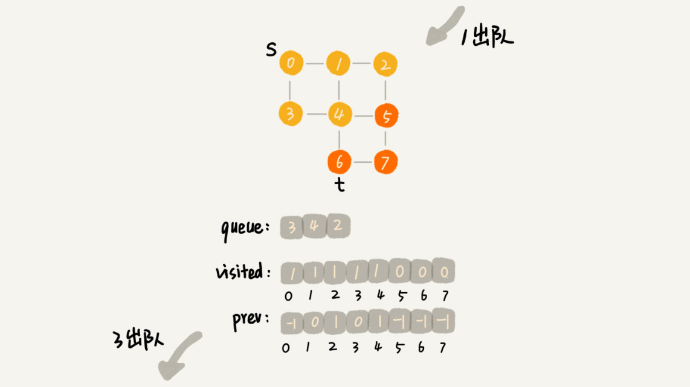

# 树（Tree）

高度（Height）、深度（Depth）、层（Level）
* 节点的高度: 节点到叶子节点的最长路径(边数)
* 节点的深度: 根节点到这个节点所经历的 边的个数
* 节点的层数: 节点的深度 + 1
* 树的高度:   根节点的高度

##  二叉树（Binary Tree） 

左子节点和右子节点

### 如何表示（或者存储）一棵二叉树
* 链式存储法
    * 每个节点有三个字段，其中一个存储数据，另外两个是指向左右子节点的指针。我们只要拎住根节点，就可以通过左右子节点的指针，把整棵树都串起来
    * 
* 顺序存储法
    * 如果节点 X 存储在数组中下标为 i 的位置，下标为 2 * i 的位置存储的就是左子节点，下标为 2 * i + 1 的位置存储的就是右子节点。反过来，下标为 i/2 的位置存储就是它的父节点。通过这种方式，我们只要知道根节点存储的位置（一般情况下，为了方便计算子节点，根节点会存储在下标为 1 的位置）
    * 完全二叉树
    
    * 非完全二叉树
    

### 二叉树的遍历
前序遍历、中序遍历和后序遍历。
其中，前、中、后序，表示的是节点与它的左右子树节点遍历打印的先后顺序


实际上，二叉树的前、中、后序遍历就是一个递归的过程。
比如，前序遍历，其实就是先打印根节点，然后再递归地打印左子树，最后递归地打印右子树

递推公式的关键就是：
如果要解决问题 A，就假设子问题 B、C 已经解决，然后再来看如何利用 B、C 来解决 A

时间复杂度 O(n)
* 前序遍历的递推公式：
    * preOrder(r) = print r->preOrder(r->left)->preOrder(r->right)
    ```
    void preOrder(Node* root) {
    if (root == null) return;
    print root // 此处为伪代码，表示打印root节点
    preOrder(root->left);
    preOrder(root->right);
    }
    ```

* 中序遍历的递推公式：
    * inOrder(r) = inOrder(r->left)->print r->inOrder(r->right)
    ```
    void inOrder(Node* root) {
    if (root == null) return;
    inOrder(root->left);
    print root // 此处为伪代码，表示打印root节点
    inOrder(root->right);
    }
    ```


* 后序遍历的递推公式：
    * postOrder(r) = postOrder(r->left)->postOrder(r->right)->print r
    ```
    void postOrder(Node* root) {
    if (root == null) return;
    postOrder(root->left);
    postOrder(root->right);
    print root // 此处为伪代码，表示打印root节点
    }
    ```

```python3
class Solution:
    def preorderTraversal(self, root: TreeNode) -> List[int]:
        if not root:
            return []
        # 前序递归
        return [root.val] + self.preorderTraversal(root.left) + self.preorderTraversal(root.right)
        # # 中序递归 
        # return self.inorderTraversal(root.left) + [root.val] + self.inorderTraversal(root.right)
        # # 后序递归
        # return self.postorderTraversal(root.left) + self.postorderTraversal(root.right) + [root.val]

# 递归2：通用模板，可以适应不同的题目，添加参数、增加返回条件、修改进入递归条件、自定义返回值
class Solution:
    def preorderTraversal(self, root: TreeNode) -> List[int]:
        def dfs(cur):
            if not cur:
                return      
            # 前序递归
            res.append(cur.val)
            dfs(cur.left)
            dfs(cur.right) 
            # # 中序递归
            # dfs(cur.left)
            # res.append(cur.val)
            # dfs(cur.right)
            # # 后序递归
            # dfs(cur.left)
            # dfs(cur.right)
            # res.append(cur.val)      
        res = []
        dfs(root)
        return res


# 迭代1：前序遍历最常用模板（后序同样可以用）
class Solution:
    def preorderTraversal(self, root: TreeNode) -> List[int]:
        if not root:
            return []        
        res = []
        stack = [root]
        # # 前序迭代模板：最常用的二叉树DFS迭代遍历模板
        while stack:
            cur = stack.pop()
            res.append(cur.val)
            if cur.right:
                stack.append(cur.right)
            if cur.left:
                stack.append(cur.left)
        return res
        
        # # 后序迭代，相同模板：将前序迭代进栈顺序稍作修改，最后得到的结果反转
        # while stack:
        #     cur = stack.pop()
        #     if cur.left:
        #         stack.append(cur.left)
        #     if cur.right:
        #         stack.append(cur.right)
        #     res.append(cur.val)
        # return res[::-1]

```

### 二叉查找树（Binary Search Tree）

二叉查找树要求，在树中的任意一个节点，其左子树中的每个节点的值，都要小于这个节点的值，而右子树节点的值都大于这个节点的值

* 二叉查找树的查找操作
    * 如果要查找的数据比根节点的值小，那就在左子树中递归查找；如果要查找的数据比根节点的值大，那就在右子树中递归查找
    ```python3
    def search(data):
        """
        搜索 返回bst中所有值为data的节点列表
        :param data:
        :return:
        """
        ret = []  # 所有搜索到的节点
        n = self.root
        while n:
            if data < n.val:
                n = n.left
            else:
                if data == n.val:
                    ret.append(n)
                n = n.right

        return ret
    ```
* 二叉查找树的插入操作

新插入的数据一般都是在叶子节点上

    * 如果要插入的数据比节点的数据大，并且节点的右子树为空，就将新数据直接插到右子节点的位置；如果不为空，就再递归遍历右子树，查找插入位置。
    * 同理，如果要插入的数据比节点数值小，并且节点的左子树为空，就将新数据插入到左子节点的位置；如果不为空，就再递归遍历左子树，查找插入位置。
    ```python3
    def insert(data):

        if self.root is None:
            self.root = TreeNode(data)
        else:
            n = self.root
            while n:
                p = n
                if data < n.val:
                    n = n.left
                else:
                    n = n.right

            new_node = TreeNode(data)
            new_node.parent = p
            
            if data < p.val:
                p.left = new_node
            else:
                p.right = new_node

        return True
    ```

* 二叉查找树的删除操作
    1. 第一种情况是，如果要删除的节点没有子节点，我们只需要直接将父节点中，指向要删除节点的指针置为 null。比如图中的删除节点 55 
    2. 第二种情况是，如果要删除的节点只有一个子节点（只有左子节点或者右子节点），我们只需要更新父节点中，指向要删除节点的指针，让它指向要删除节点的子节点就可以了。比如图中的删除节点 13
    3. 第三种情况是，如果要删除的节点有两个子节点，这就比较复杂了。我们需要找到这个节点的右子树中的最小节点，把它替换到要删除的节点上。然后再删除掉这个最小节点，因为最小节点肯定没有左子节点（如果有左子结点，那就不是最小节点了），所以，我们可以应用上面两条规则来删除这个最小节点。比如图中的删除节点 18
    4. 


* BFS DFS

* 广度优先搜索算法(BFS)

    * 横向优先搜索，优先搜索同以层次的节点

        

    * 广度优先搜索的分解图

        
        
        
    * 广度优先搜索的空间消耗主要在几个辅助变量 visited 数组、queue 队列、prev 数组上

* 深度优先搜索算法(DFS)

    * 是一种用于遍历或搜索树或图的算法。沿着树的深度遍历树的节点，尽可能深的搜索树的分支。当节点v的所在边都己被探寻过，搜索将回溯到发现节点v的那条边的起始节点

        
    * 深度优先搜索的分解图
        
    * 深度优先搜索算法的消耗内存主要是 visited、prev 数组和递归调用栈
